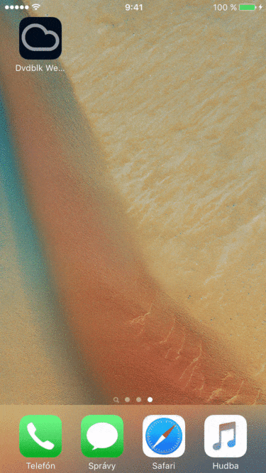
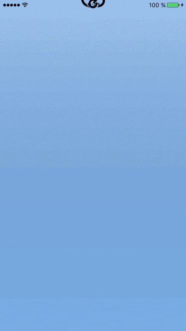

# Simple-Weather

Basic weather information app written purely in Swift for an organization in Brno.

## Features

- Displays current weather information in Brno
- (four)five day forecast
- Simple and clean day / night design with pull to refresh to get current stats

## Visuals

#### Night mode

  

Stars are randomly generated every night cycle change.

#### Day mode

  

Background color is affected by current cloudiness.

## Content used

- Modified jcavar's library for custom pull to refresh [Refresher](https://github.com/jcavar/refresher).
- JSON parsing with [SwiftyJSON](https://github.com/SwiftyJSON/SwiftyJSON)
- Images from various free weather icon websites. ([Meteocons](http://www.alessioatzeni.com/meteocons/), [Climacons](http://adamwhitcroft.com/climacons/) ...)

> DISCLAIMER: Weather API website is pretty unreliable when it comes to taking more than "average" requests per minute and returns HTTP 429 status code which stands for too many requests when you do so. Hence why I've put some json data to my website to make testing possible, if you would like to use it instead, look at the top of Downloader.swift file.

